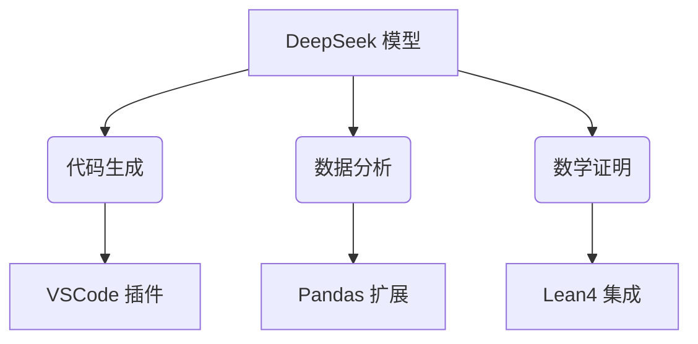

# use-deepseek-py  
🔥 使用 DeepSeek 构建大模型应用的 Python 工具包  

## 🚀 快速开始

## 📊 模型选型指南
### 性能对比表
| 模型名称                  | 参数量 | 上下文长度 | 适用场景          | 推理速度 (tokens/s) |  
|--------------------------|--------|------------|-------------------|---------------------|  
| deepseek-v3-base         | 671B   | 128k       | 代码生成/数据分析  | 320 (A100)          |  
| deepseek-r1-32b-distill  | 32B    | 64k        | 数学推理/逻辑推导  | 580 (RTX 4090)      |  
| deepseek-r1-zero         | 37B    | 128k       | 多轮对话/创意写作  | 420 (A100)          |  

💡 建议搭配 vLLM 推理框架实现吞吐量优化

## 🛠️ 进阶功能
### API 对接
```python
import os
from deepseek import DeepSeekAPI

client = DeepSeekAPI(
    api_key=os.getenv("DEEPSEEK_KEY"),
    base_url="https://api.deepseek.com/v1"
)

# 带思维链的复杂推理
response = client.chat.completions.create(
    model="deepseek-reasoner",
    messages=[{"role": "user", "content": "证明勾股定理"}],
    temperature=0.7,
    reasoning_depth=2  # 启用二级推理验证
)
print(response.choices[0].message.reasoning_content)  # 显示验证过程
```

### 本地部署优化
```yaml
# config.yaml
compute:
  precision: bfloat16
  parallelism:
    tensor: 2
    pipeline: 4
optimization:
  flash_attention: true
  continuous_batching: true  
quantization:
  enabled: true
  method: awq
```

## 🌟 核心优势
### 技术创新
- **动态专家选择**：仅激活 37B/671B 参数，降低 95% 计算成本 
- **多模态注意力**：MLA 机制提升长文本理解能力（128k tokens） 
- **强化学习优化**：GRPO 算法增强推理能力

### 开源生态


## 🏆 性能基准
| 测试集         | DeepSeek-R1 | GPT-4 | 提升幅度 |  
|----------------|-------------|-------|---------|  
| HumanEval      | 73.78%      | 67%   | +10%    |  
| GSM8K          | 84.1%       | 80%   | +5%     |  
| MATH-500       | 68.3%       | 65%   | +5%     |  
| 训练能耗 (PFLOPs)| 2.8M        | 12M   | -76%    |  

数据来源：DeepSeek 技术白皮书

## 🛡️ 最佳实践
1. **成本控制**  
```python
# 启用动态批处理
model.set_optimization(
    max_batch_size=32,
    memory_utilization=0.85
)
```
2. **错误处理**  
```python
try:
    response = model.generate(...)
except DeepSeekError as e:
    if "rate_limit" in str(e):
        print("触发限流，自动重试中...")
        time.sleep(1)
        response = model.generate(...)
```

3. **性能监控**  
```bash
deepseek-monitor --model deepseek-r1 --metrics latency throughput error_rate
```

*本项目的模型权重遵循 DeepSeek 社区许可协议，商业使用需遵守[附加条款](https://www.deepseek.com/license)*
